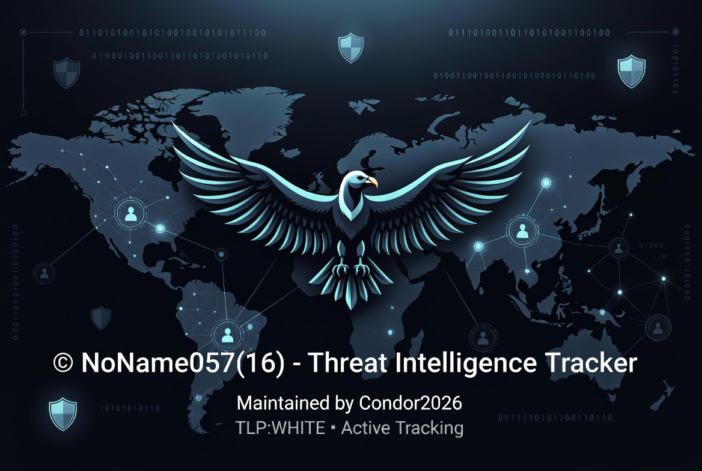
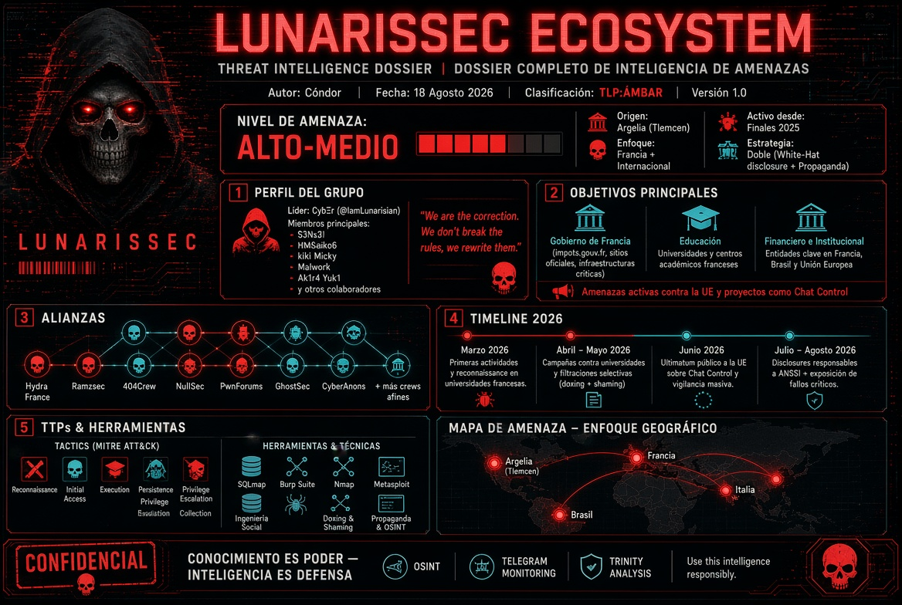
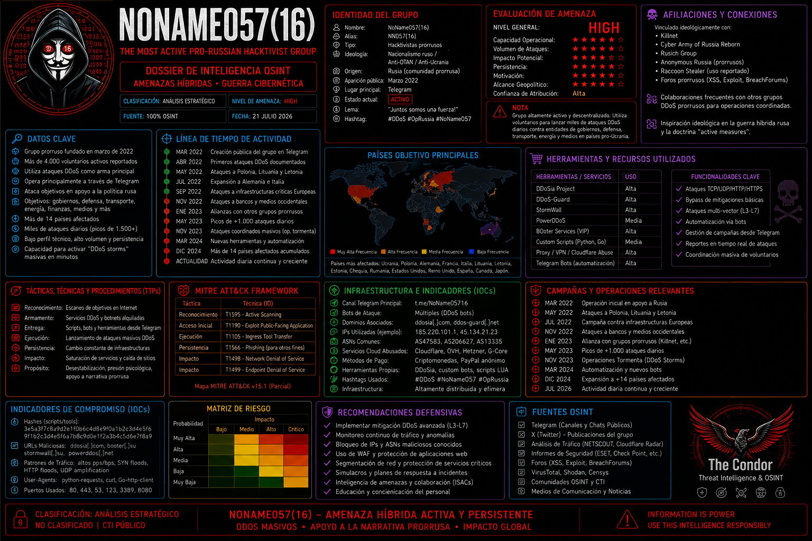

#PersonalREADME

  

> *"Knowing the enemy is the first step to defending yourself."*

**OSINT Analyst & Digital Threat Hunter**  
Research · Intelligence · Development

---

## Operational Profile

Threat Intelligence Analyst with a primary focus on persistent threats, hacktivist coalitions, and organized cybercrime. Specialized in Open Source Intelligence (OSINT), Tactics, Techniques, and Procedures (TTP) analysis aligned with the MITRE ATT&CK framework, and the development of early warning systems for detecting malicious infrastructure.

All operations are conducted strictly through open sources and publicly available data, in full compliance with legal and ethical standards. The approach is oriented toward producing **actionable intelligence** for the defense of critical infrastructure and national strategic interests.

**Operational anonymity is maintained until formal engagement with institutional entities (SOCs, CSIRTs, Governments) is established, subject to NDA or formal contract.** Personal identifying information is disclosed exclusively upon verified institutional interest and confidentiality guarantees.

---

## Core Competencies

| Area | Description |
|------|-------------|
| **🔍 Threat Intelligence Monitoring** | Continuous monitoring of threat actors, campaigns, and TTP evolution. |
| **🎣 Phishing Campaign Analysis** | In-depth analysis of phishing campaigns, infrastructure tracking, and malware correlation. |
| **👤 Threat Actor Profiling** | Attribution and behavioral profiling of APT groups, hacktivists, and cybercriminal syndicates. |
| **🌐 OSINT Investigations** | Custom OSINT investigations across surface, deep, and dark web sources. |
| **📊 Executive & Technical Reporting** | Tailored intelligence reports for both technical teams and executive leadership. |
| **🤖 Python Automation for CTI/OSINT** | Development of scrapers, ETL pipelines, and automation workflows for intelligence gathering. |
| **⚡ IOC Collection & Enrichment** | Aggregation, enrichment, and correlation of Indicators of Compromise (IoCs). |
| **🛠️ Custom Tool Development** | Design and deployment of bespoke security tools for defensive and investigative purposes. |
| **📡 Cybercriminal Ecosystem Monitoring** | Continuous surveillance of cybercriminal forums, Telegram channels, and underground markets. |
| **🛡️ Strategic Security Consulting** | Advisory services for institutional cybersecurity strategy and risk management. |

---

## Technical Stack

`Python` · `OSINT` · `CTI` · `Flask` · `APIs` · `Automation` · `MITRE ATT&CK` · `Git` · `Linux`

---

## Areas of Interest

`Threat Intelligence` · `Passive OSINT` · `Pro-Russian Group Analysis` · `Killnet/NoName Tracking` · `LATAM Organized Crime` · `DDoS Infrastructure Mapping` ·  `Actor Attribution` ·  `Defensive Social Engineering` · `Intelligence Dashboards` · `Cyber Crime Analytics`

---

## Analysis Focus Areas

| Domain | Description |
|--------|-------------|
| **Pro-Russian Hacktivism** | Active tracking of Killnet, NoName057(16), DarkStorm, RootSec, Electus, and BotnetKingdom. Comprehensive DDoS infrastructure and TTP mapping. |
| **Organized Crime (LATAM & Europe)** | Analysis of drug trafficking, extortion, homicides, and gender-based violence patterns using passive OSINT on digital press (Diabolic suite). |
| **Malicious Infrastructure** | Domain, IP, SSL certificate, WHOIS, JARM fingerprinting, and IOC correlation for actor attribution (ShinyHunters, LAPSUS$, etc.). |
| **Advanced OSINT** | Mass data extraction from Telegram, Discord, forums, and digital press. Geolocation, digital footprint analysis, and public data correlation. |
| **Threat Prevention** | Early warning systems (Andrómeda) and monitoring dashboards for botnets and aggressive scanning (Nebula). |
| **Defensive Social Engineering** | Phishing attack detection and simulation for training and reporting of severe crimes (pedophilia, terrorism). |

| Role | Description |
|------|-------------|
| **🔍 Threat Intelligence Analyst** | Monitoring, analysis, and reporting on actors and campaigns (APT, hacktivism, organized crime). |
| **🛡️ Purple Team / Threat Hunter** | Proactive detection, IoC correlation, adversary emulation, and defense gap identification. |
| **🌐 OSINT Investigator** | Digital footprint analysis, infrastructure geolocation, and public record correlation for legal or corporate cases. |
| **🤖 Automation Developer (CTI/OSINT)** | Development of scrapers, dashboards, API integrations, and ETL pipelines for intelligence. |
| **📊 Cybercrime Analyst** | Analysis of criminal patterns in LATAM, Europe, and Spanish-speaking regions. |
| **🧠 Security Consultant / Advisor** | Strategic cyber defense advisory, risk management, and incident response planning. |

---

## Technologies & Tools

| Category | Technologies |
|----------|--------------|
| **Languages** |       |
| **IDE / Environments** |   |
| **OSINT / Security** |            |
| **Threat Intelligence Platforms** |        |
| **Scraping & Automation** |      |
| **Visualization & Web** |        |
| **Databases** |     |
| **Version Control** |    |
| **Operating Systems** |        |
| **OSINT Platforms** |       |
| **Knowledge Domains** |    |
| **Core Methodologies** | `MITRE ATT&CK` · `TTPs` · `IoCs` ·  `Diamond Model` · `Cyber Kill Chain` · `Intelligence Driven Defense` · `DevOps` · `CI/CD` |
| **Specializations** |  `Botnet Detection` · `Malware Analysis` · `Phishing Analysis` · `Social Engineering Defense` · `Fraud Detection` · `Crime Analysis` · `Investigative Journalism` · `Threat Actor Profiling` · `Takedown Coordination` |

---

## Methodologies & Practices

`MITRE ATT&CK` · `TTPs` · `IoCs` · `Threat Intelligence` · `Passive OSINT` · `Cyber Crime Analytics` · `DevOps` · `CI/CD Pipelines` · `Diamond Model` · `Cyber Kill Chain` 
 

---

*Note: These reports are interconnected. For instance, the Russian hacktivist ecosystem (CIBERWAR, Killnet, NoName) feeds into the CTI RUSSIAN and CTI GLOBAL reports, while regional criminal analyses (Di4bolic series, Keltic Kraken) provide ground-level OSINT validation for broader geopolitical threat assessments.*
 

---

## Work Philosophy

- **Anonymity as a Shield:** Identity protection is maintained strictly for operational security, not as a weapon.
- **Open Source for Education:** Public tools (Nebula, Diabolic series) are released to educate and empower the community.
- **Trust is Earned Through Results:** Credibility is built on the quality and accuracy of intelligence outputs, not certifications or public posturing.
- **Legal & Ethical Compliance:** All activities are conducted within legal frameworks, using only open-source and publicly available data.

---

## Availability

- **Strategic Consulting** for institutional and governmental entities.
- **Threat Intelligence Analysis** on persistent threats, hacktivism, and organized crime.
- **Automation Development** for CTI and OSINT workflows.
- **SOC & CSIRT Support** in threat hunting, IOC correlation, infografy and incident response.
-  
---

## Contact (Secure Channels)

For operational security reasons, personal data and direct contacts are provided exclusively during formal interviews or after signing a non-disclosure agreement (NDA) with institutional entities.

| Channel | Handle |
|--------|--------|
| **⌨️ Telegram** | `Private` |
| **🐦 Twitter/X** | `@BatIntelSec` \|
| **☣️ VirusTotal** | `BatIntelSec` |
| **📧 Email** | `.` |
| **💼 LinkedIn** | `Not used` |

## 📈 Language & Stats

  

  

  

  

---

## Background

The journey began as an independent researcher operating in hostile digital environments. Over time, this experience was transformed into scalable prevention frameworks and actionable intelligence platforms.

Today, the focus remains on monitoring persistent threat groups, developing early detection systems, and publishing actionable intelligence for the defense of critical infrastructure. The background provides a unique understanding of adversary TTPs, cultivated through practical experience rather than formal coursework.

Self-taught, with a strong emphasis on operational security, the creator of **Andrómeda** (private counter-intelligence system) and **Nebula** (public demo). Specializations include botnet detection, pro-Russian group tracking, DDoS infrastructure mapping, and persistent threat analysis.

---

**🔍 Open to collaboration** – Threat Intelligence, OSINT, Purple Team, Automation.

---

> *Producing actionable intelligence through rigorous OSINT and TTP analysis.*

---

**Maintained by:** ClearWhiteNet– Threat Security · Purple Team · Intelligence · Defense

  

